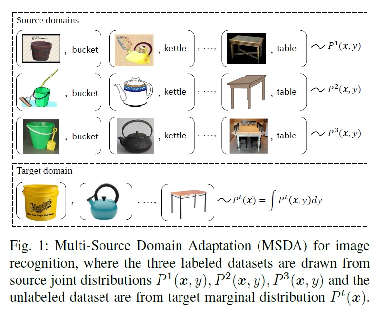
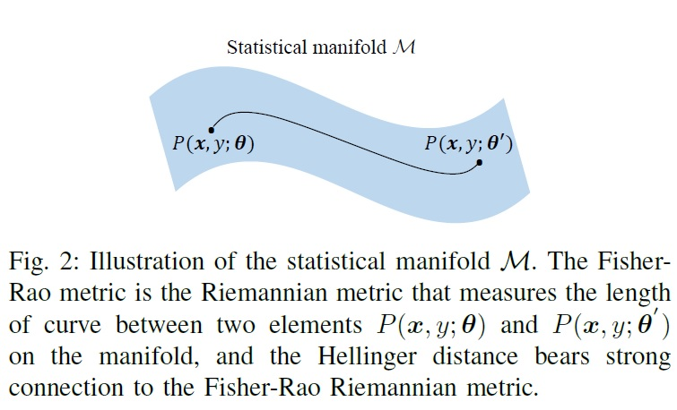

# Riemannian Representation Learning (RRL)


This repository provides the Pytorch code for the work "Riemannian Representation Learning for Multi-Source Domain Adaptation" published in Pattern Recognition, 2023. In this work, we study the multi-source domain adaptation problem (see Fig.1), and propose the Riemannian Representation Learning (RRL) approach to addressing the problem. Guided by our theoretical analysis, our approach trains a neural network model by minimizing (i) the average empirical Hellinger distance with respect to the network representation function, and (ii) the average empirical source error with respect to the network model. The Hellinger distance bears strong connection to the Riemannian metric defined on the statistical manifold and therefore well reflects the geometrical distance between probability distributions (see Fig.2).





##### Tested on
* Python 3.8
* PyTorch 1.11.0
* CUDA 11.4

#### Dataset folder
The folder structure required (e.g OfficeHome)
- data
  - OfficeHome
    - list
      - Art.txt
      - Clipart.txt
      - Prduct.txt
      - Real.txt
    - Art
    - Clipart
    - Product
    - Real


##### How to run

```bash
python demo.py --dataset officehome --source Art Product Real --target Clipart --phase pretrain --gpu 0 --net resnet --steps 200000 --start_update_step 2000 --update_interval 2000 --message "Riemannian Representation Learning" --patience 45 --lr 0.01 --lr_mult 0.1 0.1 1 1
python demo.py --dataset officehome --source Art Product Real --target Clipart --phase train --gpu 0 --net resnet --steps 200000 --start_update_step 2000 --update_interval 2000 --message "Riemannian Representation Learning" --patience 45 --lr 0.01 --lr_mult 0.1 0.1 1 1
```


For more details of this multi-source domain adaptation approach,  please refer to the following PR work: 

@article{Chen2023Riemannian,  
  author={Sentao Chen and Lin Zheng and Hanrui Wu},  
  journal={Pattern Recognition},   
  title={Riemannian Representation Learning for Multi-Source Domain Adaptation},   
  year={2023},   
  pages={109271},  
  doi={https://doi.org/10.1016/j.patcog.2022.109271}  
  }
  
The Pytorch code is currently maintained by Lisheng Wen. If you have any questions regarding the code, please contact Lisheng Wen via the email wenlisheng992021@163.com.
